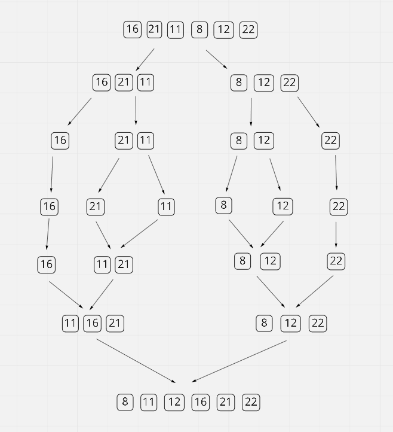
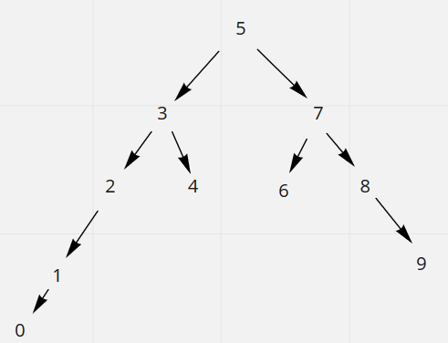

# Insertion Sort Projesi


`[22,27,16,2,18,6] -> Insertion Sort`


1. **Yukarı verilen dizinin sort türüne göre aşamalarını yazınız.**
>```
> [22,27,16,2,18,6] => 1.Aşama [n]
>
>[2,27,16,22,18,6] => 2.Aşama [n-1]
>
>[2,6,16,22,18,27] => 3.Aşama [n-2]
>
>[2,6,16,18,22,27] => 4.Aşama [1]
>```

2. **Big-O gösterimini yazınız.**

>```
> n + n-1 + n-2 + 1 = [n * (n+1) / 2]
>
> [ n^2 + n / 2] = O(n^2)
>```

3. **Time Complexity:**
- *Average case*: Aradığımız sayının ortada olması.
- *Worst case*: Aradığımız sayının sonda olması.
- *Best case*: Aradığımız sayının dizinin en başında olması.

>```
> Avarage case: [2,6,16,18,22,27] > 16-18
>
> Worst case: [2,6,16,18,22,27] > 27
>
> Best case: [2,6,16,18,22,27] > 2
>```

4. **Dizi sıralandıktan sonra 18 sayısı hangi case kapsamına girer? Yazınız.**

> `Avarage case kapsamına girer.`

5. [7,3,5,8,2,9,4,15,6] dizisinin Insertion Sort'a göre ilk 4 adımını yazınız.

> ```
> [7,3,5,8,2,9,4,15,6] => 1.Aşama [n]
>
> [2,3,5,8,7,9,4,15,6] => 2.Aşama [n-1]
>
> [2,3,4,8,7,9,5,15,6] => 3.Aşama [n-2]
>
> [2,3,4,5,7,9,8,15,6] => 4.Aşama [n-3]
> ```

# Merge Sort Projesi

`[16,21,11,8,12,22] -> Merge Sort`

1. **Yukarıdaki dizinin sort türüne göre aşamalarını yazınız.**



2. **Big-O gösterimini yazınız.**

> ```
> Her aşamada O(n) geliyor.
> n = 2^x
> logn = x
> O(n logn)
> ```

# Binary Search Tree Projesi

`[7, 5, 1, 8, 3, 6, 0, 9, 4, 2] => Binary Search Tree`

```
Sıralanmış hali: [0, 1,  2,  3,  4,  5,  6,  7,  8,  9]
Root değer: 5

Dengeli bir dağılım yapmamız için..

Sağındaki sayı: 7
Solundaki sayı: 3
```

1. **Yukarıdaki dizinin Binary-Search-Tree aşamalarını yazınız.**


